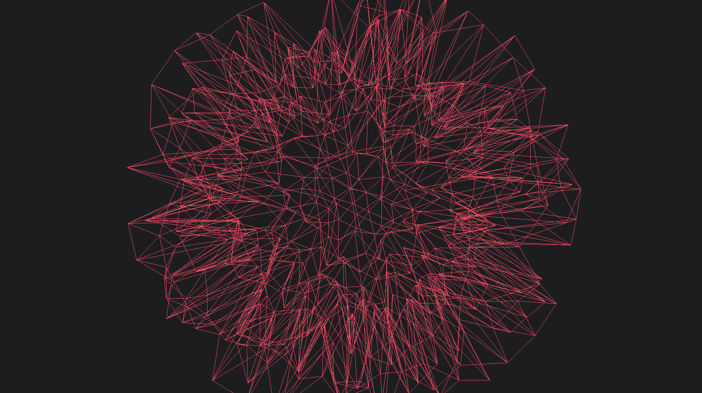
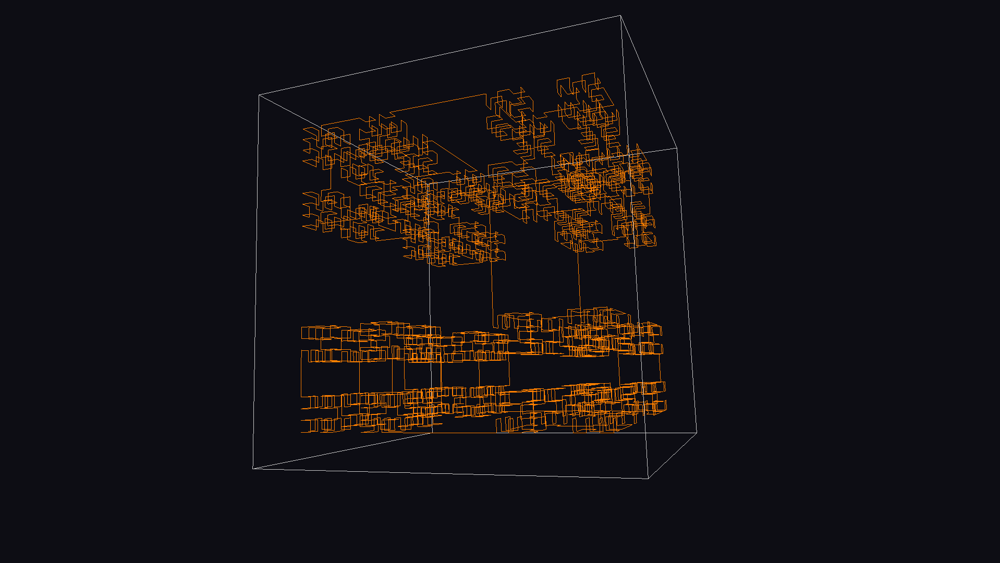
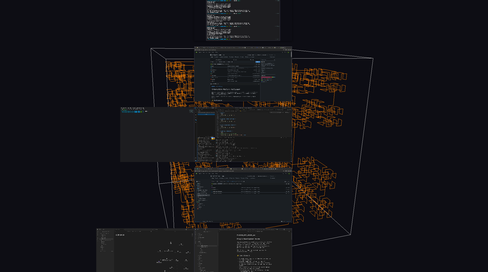

[README ru](README_ru.md) | [README en](README.md)
# Interactive Wayland Wallpaper 

Красивые, интерактивные и легко настраиваемые живые обои для вашего рабочего стола на Wayland. Проект использует аппаратное ускорение (OpenGL ES) для рендеринга динамических шейдеров с минимальным потреблением ресурсов.

Основной эффект — анимированная икосфера, которая реагирует на движения вашего курсора и музыку.

## ✨ Особенности

- [x] **GPU-ускорение**: Плавный рендеринг с помощью OpenGL ES, не нагружающий CPU
- [x] **Интерактивность**: Обои реагируют на движения мыши и тачпада
- [ ] **Аудио-реактивность**: Визуализация в реальном времени реагирует на музыку
- [x] **Гибкая настройка**: Все параметры настраиваются через JSON-конфигурацию
- [x] **Горячая перезагрузка**: Изменения применяются на лету без перезапуска
- [x] **Модульность**: Поддержка плагинов с различными эффектами
- [x] **Автоматическое управление**: Удобные скрипты для запуска и настройки

## 🎭 Демонстрация 

[](https://imgur.com/a/shader-CkNPDLc)

[](https://imgur.com/a/shader-CkNPDLc)

[](https://imgur.com/a/shader-CkNPDLc)

[](https://imgur.com/a/shader-CkNPDLc)

## Архитектура проекта

Проект состоит из нескольких взаимодействующих частей:

#### Основные компоненты:
- **`interactive-wallpaper`**: Ядро системы, отвечает за отображение обоев на GPU.
- **`evdev-pointer-daemon`** (опционально): Демон для обработки событий мыши/тачпада в обход ограничений Wayland.
- **`audio-daemon`** (опционально): Демон для анализа звука в реальном времени и передачи данных основному приложению.

#### Вспомогательные утилиты:
- **`config-manager.sh`**: Скрипт для удобного управления
  JSON-конфигурацией из командной строки.
- **`run.sh`**: Скрипт для запуска, остановки и перезапуска всех компонентов системы.
- **`plugin-interrogator`**: Утилита, которая позволяет скриптам получать информацию (имя, параметры по умолчанию) напрямую из скомпилированных `.so` файлов плагинов.
- **`generate_plugin.py`**: Скрипт для разработчиков, который автоматически создает C++/CMake "обвязку" для нового плагина на основе комментариев в GLSL-шейдере.

> Проект тестировался и собирался на Arch Linux с композитором Niri.
> Работа на других дистрибутивах возможна, но не гарантируется.

## 🏗️  Установка и настройка

### 1. Подготовка рабочей директории

Создайте общую директорию для всех компонентов проекта:

```bash
mkdir path/interactive-wallpaper
cd path/interactive-wallpaper
```

### 2. Клонирование репозиториев

**Все три компонента должны быть клонированы как соседи в одну директорию `path/interactive-wallpaper`:**

```bash
# Основное приложение
git clone https://gitea.com/SeeTheWall/shader-desk

# Демон мыши (для обработки ввода)
git clone https://gitea.com/SeeTheWall/mouse

# Демон аудиоанализатора (для анализа звука)  
# Аудио демон не опубликован (еще не готов) и эту часть нужно пропустить.
# git clone https://gitea.com/SeeTheWall/audio-daemon
```


После клонирования структура директорий должна выглядеть так:
```
path/interactive-wallpaper/
├── shader-desk/    # Основное приложение
├── mouse/          # Демон мыши
└── audio-daemon/   # Демон аудиоанализатора
```

### 3. Установка зависимостей

Устанавливайте зависимости только для тех компонентов, которые планируете использовать.
#### **Шаг 1: Основное приложение (Обязательно)**
Эти команды установят все необходимое для сборки и запуска ядра `interactive-wallpaper` и его утилит.

* **Arch Linux / Manjaro:**
  ```bash
  sudo pacman -S base-devel cmake git wayland wayland-protocols libglvnd glm nlohmann-json jq inotify-tools
  ```
* **Ubuntu / Debian:**
  ```bash
  sudo apt update && sudo apt install build-essential cmake git wayland-protocols libwayland-dev libglvnd-dev libglm-dev nlohmann-json3-dev jq inotify-tools
  ```
* **Fedora:**
  ```bash
  sudo dnf install cmake gcc-c++ git wayland-devel wayland-protocols-devel mesa-libGL-devel glm-devel nlohmann-json-devel jq inotify-tools
  ```

#### **Шаг 2: Демон мыши (Опционально)**
Устанавливайте, только если вам нужна интерактивность от мыши или тачпада.

* **Arch Linux / Manjaro:**
  ```bash
  sudo pacman -S libevdev
  ```
* **Ubuntu / Debian:**
  ```bash
  sudo apt install libevdev-dev
  ```
* **Fedora:**
  ```bash
  sudo dnf install libevdev-devel
  ```

#### **Шаг 3: Аудио-демон (Опционально)**

> В данный момент эта часть проекта не готова. 
Аудио демон не опубликован и эту часть нужно пропустить. 

Устанавливайте, только если вам нужна аудио-реактивность.

* **Arch Linux / Manjaro:**
  ```bash
  sudo pacman -S pulseaudio fftw
  ```
* **Ubuntu / Debian:**
  ```bash
  sudo apt install libpulse-dev libfftw3-dev
  ```
* **Fedora:**
  ```bash
  sudo dnf install pulseaudio-libs-devel fftw-devel
  ```

### 4. Сборка основного приложения

```bash
cd path/interactive-wallpaper/shader-desk
mkdir build && cd build
cmake ..
make -j$(nproc)
```

**Что происходит при сборке:**

- Собирается основное приложение `interactive-wallpaper`
- Автоматически компилируются все плагины из папки `plugins/`:
- Формируется папка `build/effects/`, содержащая .so файлы и папку с шейдерами эффектов. 

### Настройка плагинов и шейдеров

После успешной сборки необходимо обеспечить доступность плагинов и шейдеров для приложения:

**Способ 1: Копирование**
```bash
# Копируем плагины и шейдеры в директорию конфигурации
cp -r path/interactive-wallpaper/shader-desk/build/effects ~/.config/interactive-wallpaper/
```

**Способ 2: Символическая ссылка**
```bash
# Создаем директорию конфигурации если ее нет
mkdir -p ~/.config/interactive-wallpaper

# Создаем символическую ссылку на собранные эффекты
ln -sf path/interactive-wallpaper/shader-desk/build/effects ~/.config/interactive-wallpaper/effects
```

Символическую ссылку рекомендуется использовать, если вы собираетесь проводить эксперименты с модификациями существующих эффектов и разработкой своих.

После ее создания отпадает необходимость каждый раз, после компиляции, копировать папку вручную. 

**Проверка установки:**
```bash
ls -la ~/.config/interactive-wallpaper/effects/
# Должны отображаться:
# ico-sphere-effect.so  pulse-color-effect.so  shaders/
```

После этой настройки можно переходить к инициализации конфигурации с помощью `config-manager.sh init`.

### 5. Сборка демона мыши (опционально)

**⚠️ Важно: Демон мыши нужен для обхода ограничений Wayland композиторов**.

В Wayland композиторы запрещают приложениям без фокуса ввода получать события мыши. Наш демон решает эту проблему, читая события напрямую из `/dev/input/`.

```bash
# Настройка прав доступа
sudo usermod -a -G input $USER
# Перезайдите в систему или выполните:
newgrp input

# Сборка демона
cd path/interactive-wallpaper/mouse
mkdir build && cd build
cmake ..
make -j$(nproc)
```

### 6. Сборка демона аудиоанализатора (опционально)

> В данный момент эта часть проекта не готова. 
Аудио демон не опубликован и эту часть нужно пропустить. 

```bash
cd path/interactive-wallpaper/audio-daemon
mkdir build && cd build
cmake ..
make -j$(nproc)
```

## ⚙️ Настройка конфигурации

### Инициализация конфигурации

```bash
cd path/interactive-wallpaper/shader-desk
./src/config-manager.sh init
```

Это создаст файл конфигурации в `~/.config/interactive-wallpaper/`.

### Управление настройками

**Справка:**
```bash
./src/config-manager.sh help
```

**Просмотр текущих настроек:**
```bash
./src/config-manager.sh show
```

**Список доступных эффектов:**
```bash
./src/config-manager.sh list
```

**Изменение параметров:**
```bash
# Включить/выключить wireframe режим
./src/config-manager.sh set wireframe_mode false

# Установить уровень детализации сферы
./src/config-manager.sh set subdivisions 4

# Настроить чувствительность мыши
./src/config-manager.sh set --global mouse_sensitivity 3.0
```

**Редактирование конфигурации вручную:**
```bash
./src/config-manager.sh edit
```

Вы также можете написать любые свои скрипты для управления параметрами ваших эффектов.
Можете просто писать в файл
`~/.config/interactive-wallpaper/config.json`. 

## 🚀 Запуск системы

### Использование скрипта run.sh

Скрипт `run.sh` автоматически управляет всеми компонентами системы:

```bash
# Перейдите в директорию основного приложения
cd path/interactive-wallpaper/shader-desk

# Сделайте скрипт исполняемым
chmod +x run.sh

# Запуск всех компонентов
./run.sh start

# Остановка всех компонентов  
./run.sh stop

# Перезапуск
./run.sh restart
```

### Ручной запуск компонентов

Вы можете запускать бинарники вручную или разработать свои скрипты для их запуска. 

**Только основное приложение:**
```bash
cd path/interactive-wallpaper/shader-desk/
./build/interactive-wallpaper

cd path/interactive-wallpaper/mouse/
./build/evdev-pointer-daemon --socket /tmp/evdev-pointer.sock

cd path/interactive-wallpaper/audio-daemon/
./build/audio-daemon
```

### Автозапуск 

Добавьте запуск sh скрипта 
`./path/interactive-wallpaper/shader-desk/run.sh start`
при загрузке вашего композитора.

Для автозапуска можно также создать systemd-unit. Пример юнита в документации пока отсутствует.
## Разработка своих эффектов.

Вы можете создать собственный эффект, если умеете писать GLSL шейдеры и немного разбираетесь в C++.

Подробное руководство по созданию плагинов находится в файле [PLUGIN_DEV_GUIDE_ru.md](PLUGIN_DEV_GUIDE_ru.md).


## 🐛 Устранение неисправностей

**Обои не запускаются:**
- Убедитесь, что [Wayland композитор поддерживает`wlr-layer-shell`](https://wayland.app/protocols/wlr-layer-shell-unstable-v1#compositor-support) 
- Проверьте вывод в терминале: `./build/interactive-wallpaper`
- Убедитесь, что создана конфигурация: `./src/config-manager.sh init`
- Убедитесь, что скопировали эффекты в папку конфига.

**Демон мыши не работает:**
- Убедитесь, что вы полностью перезашли в систему (logout/login) после добавления в группу `input`. 
- После перезахода проверьте, что вы состоите в группе:
  `groups | grep input`
- Проверьте сокет: `ls -la /tmp/evdev-pointer.sock`

**Аудио не работает:**
- Убедитесь, что демон аудиоанализатора запущен
- Проверьте настройки аудио в конфигурации
- Убедитесь, что в системе есть аудиовыход

**Изменения не применяются:**
- Убедитесь, что приложение запущено с правильным конфигом и в файле `config.json` нет опечаток. 

## 🤝 Содействие

Вклад в проект приветствуется! Если у вас есть идеи, предложения или исправления, пожалуйста, создавайте Issues или Pull Requests.

## 📜 Лицензия

Этот проект распространяется под лицензией MIT. Подробности смотрите в файле `LICENSE`.
